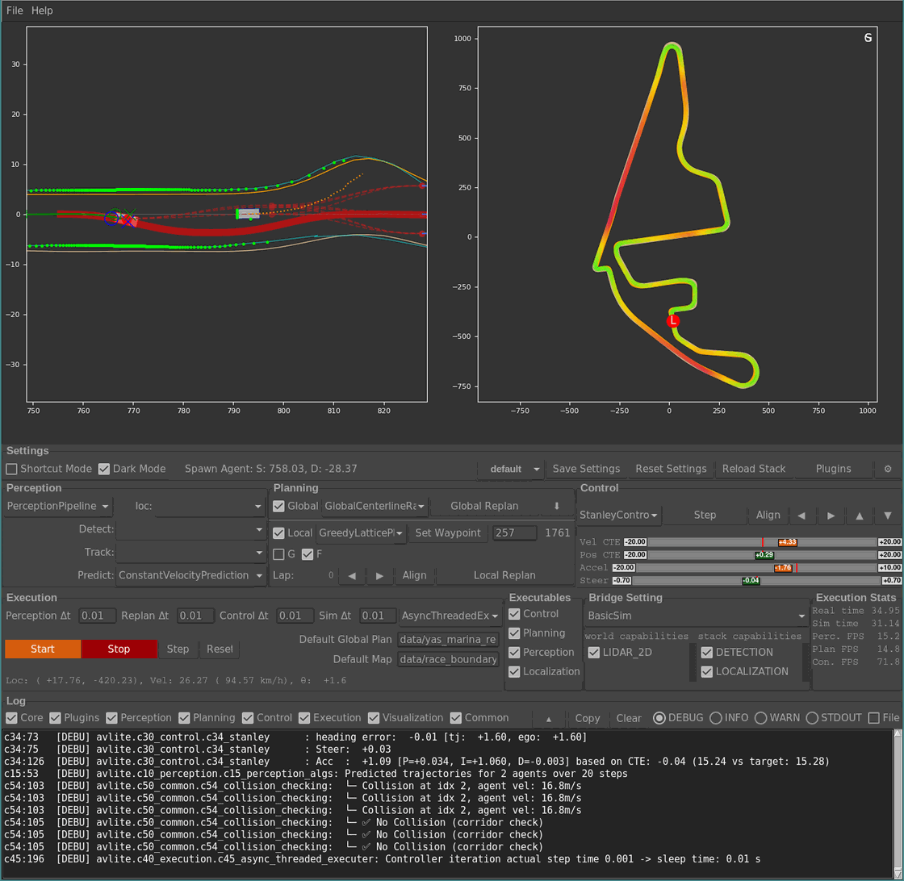
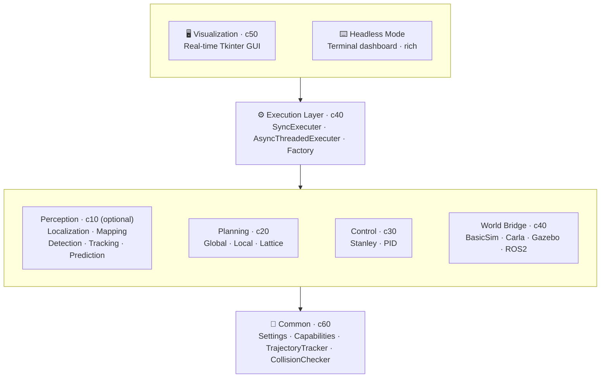

<p align="center">
  
</p>

# AVLite - Modular Autonomous Vehicle Stack

AVLite is a lightweight, extensible autonomous vehicle software stack designed for rapid prototyping, research, and education. It provides clean abstractions for perception, planning, and control while maintaining flexibility through a plugin-based architecture.

**ROS2 & Autoware Ready**: Built-in ROS2 executor extension (`executer_ROS2`) with native Autoware message support (Trajectory, ControlCommand, etc.).



## Architecture Overview

AVLite follows a modular architecture with clear separation of concerns:



### Core Components

- **c10_perception**: Interfaces for detection, tracking, prediction, localization (optional), mapping; HD map support
- **c20_planning**: Global planning (A*, HD map routing) and local planning (lattice-based, RRT)
- **c30_control**: Vehicle control algorithms (Stanley, PID)
- **c40_execution**: Execution orchestration with support for sync/async modes and simulator bridges
- **c50_visualization**: Real-time Tkinter-based GUI for debugging and monitoring
- **c60_common**: Utilities, settings management, and capability definitions
- **extensions**: Plugin system for custom components (includes ROS2 executor with Autoware messages)

### Key Features

**Strategy Pattern Architecture**: All major components (perception, localization, planning, control) use the strategy pattern with automatic registration, allowing runtime selection and hot-reloading without code changes.

**Capability-Based System**: Components declare their requirements and capabilities, enabling automatic compatibility checking between perception/localization strategies and world bridges.

**Optional Perception & Localization**: Both perception and localization are optional in the execution pipeline. Run with ground truth data or plug in your own strategies as needed.

**YAML-Based Configuration**: Profile-based configuration system allows quick switching between different algorithm combinations and parameters.

**Hot Reloading**: Modify code and configuration files while the system is running without restarting.

**Multiple Simulator Support**: Works with BasicSim (built-in), CARLA, Gazebo, and ROS2/Autoware through abstract world bridge interface.

**Extensible Plugin System**: Add custom perception, planning, or control algorithms as plugins without modifying core code.

## Why AVLite?

- **Lightweight**: Small codebase focused on clarity over production complexity
- **No middleware lock-in**: Works standalone; ROS2/Autoware integration is optional via built-in extension
- **Multi-simulator**: Same code runs on BasicSim, Carla, or Gazebo
- **Rapid iteration**: Hot-reload code and tune parameters without restarting
- **Minimal dependencies**: Core needs only NumPy, Matplotlib, Tkinter
- **Educational**: Numbered modules and clean abstractions for learning

## Installation

**Minimal** (core functionality):
```bash
pip install -r requirements-minimal.txt
```

**Full** (includes joystick support, dev tools, docs):
```bash
pip install -r requirements-full.txt
```

**Optional integrations** (install separately as needed):
- **CARLA**: Install from [CARLA releases](https://github.com/carla-simulator/carla/releases)
- **ROS2 + Autoware**: Install ROS2 (Humble/Iron/Jazzy) and optionally `autoware_auto_msgs` for native Autoware message support. AVLite's `executer_ROS2` extension provides ROS2 nodes and Autoware message converters out of the box.

Run from source:
```bash
python -m avlite
```

Install system-wide:
```bash
pip install .
```

## Quick Start

1. Launch the visualizer: `python -m avlite`
2. Select a profile from the Config tab (e.g., "default")
3. Click "Start/Stop Stack" to begin execution
4. Right-click on the plot to spawn NPC vehicles
5. Adjust parameters in real-time through the GUI

## Headless Mode

For long-running deployments (robots, servers, CI) AVLite ships a minimal
terminal dashboard that runs the executer without a GUI.

```bash
# Run with the 'default' profile
python -m avlite headless

# Pick a profile (saved from the visualizer)
python -m avlite headless -p my_robot_profile
python -m avlite headless my_robot_profile          # positional shortcut

# Useful options
python -m avlite headless -p my_robot_profile \
    --log-level WARNING \
    --control-dt 0.01 --replan-dt 0.5 --perceive
```

The dashboard shows live FPS, ego state, lap counter, and recent log lines.
Press **Ctrl+C** to stop.

Requires the optional [`rich`](https://github.com/Textualize/rich) package:

```bash
pip install rich
```

### Recommended workflow

1. **Configure** with the visualizer (`python -m avlite`): pick the bridge,
   strategies, and tune parameters until it behaves the way you want.
2. **Save** the result as a named profile from the Config tab.
3. **Deploy** that profile on your robot/server with
   `python -m avlite headless -p <profile>`.

The same YAML profiles drive both the GUI and headless mode, so what you
see in the visualizer is what the robot will run.

## Community Plugins

AVLite has a community plugin system that lets anyone publish perception,
planning, control, executer, or world-bridge strategies as a small Git
repository.

**Browse and install** from the GUI:

```bash
python -m avlite plugins
```

The browser fetches the official registry
(<https://github.com/AV-Lab/avlite-community-plugins>) and lets you
install, uninstall, and register plugins with the active profile.
Installed plugins live under `$XDG_DATA_HOME/avlite/plugins`
(or `~/.local/share/avlite/plugins`); override with `AVLITE_PLUGINS_DIR`.

**Publish your own plugin**:

1. Build a plugin following the [Plugin Development Guide](docs/plugin-development.md).
2. Push it to a public Git repository.
3. Fork <https://github.com/AV-Lab/avlite-community-plugins>, add an entry
   to `plugins.yaml`:

   ```yaml
   plugins:
     - name: my_cool_planner
       repository: https://github.com/<you>/my_cool_planner
       version: latest        # or a tag/commit SHA
       description: One-line summary
       author: Your Name
   ```

4. Open a pull request. Once merged it shows up automatically in every
   user's `avlite plugins` browser.

## Project Structure

AVLite uses a numbered module system for easy navigation:

```
avlite/
├── c10_perception/         # Perception components
│   ├── c11_perception_model.py
│   ├── c12_perception_strategy.py
│   ├── c13_localization_strategy.py
│   ├── c14_mapping_strategy.py
│   ├── c18_hdmap.py
│   └── c19_settings.py
├── c20_planning/           # Planning components
│   ├── c21_planning_model.py
│   ├── c22_global_planning_strategy.py
│   ├── c23_local_planning_strategy.py
│   ├── c24_global_planners.py
│   ├── c26_local_planners.py
│   ├── c27_lattice.py
│   └── c29_settings.py
├── c30_control/            # Control components
│   ├── c31_control_model.py
│   ├── c32_control_strategy.py
│   ├── c33_pid.py
│   ├── c34_stanley.py
│   └── c39_settings.py
├── c40_execution/          # Execution and simulation
│   ├── c41_execution_model.py
│   ├── c42_factory.py
│   ├── c43_sync_executer.py
│   ├── c44_async_threaded_executer.py
│   ├── c46_basic_sim.py
│   └── c49_settings.py
├── c50_visualization/      # GUI and plotting
│   ├── c50_community_plugins_app.py
│   ├── c51_visualizer_app.py
│   ├── c52_plot_views.py
│   ├── c53_perceive_plan_control_views.py
│   ├── c54_exec_views.py
│   ├── c55_log_view.py
│   ├── c56_config_views.py
│   ├── c57_plot_lib.py
│   ├── c58_ui_lib.py
│   └── c59_settings.py
├── c60_common/            # Utilities
│   ├── c61_setting_utils.py
│   ├── c62_capabilities.py
│   ├── c63_trajectory_tracker.py
│   └── c64_collision_checking.py
└── extensions/            # Built-in extensions
    ├── bridge_carla/
    ├── bridge_gazebo/
    ├── bridge_ROS2/
    ├── executer_ROS2/
    └── multi_object_prediction/
```

The numbering scheme allows quick navigation: search for "c23" to find local planning, "c34" for Stanley controller, etc.

## Developing Custom Plugins

See the [Plugin Development Guide](docs/plugin-development.md) for detailed instructions on creating custom perception, planning, and control components.


