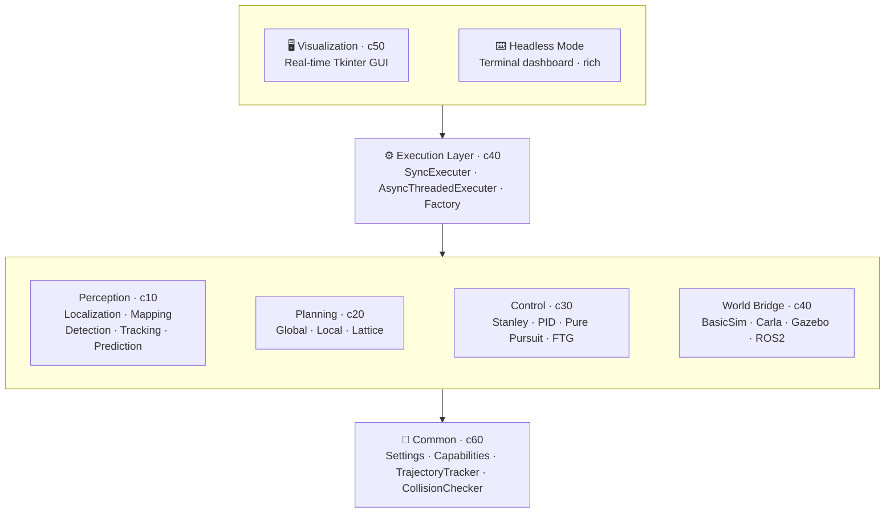

<p align="center">
  
</p>

<h1 align="center">AVLite</h1>

<p align="center">
  <strong>Modular Autonomous Vehicle Stack for rapid prototyping, research, and education.</strong>
</p>

<p align="center">
  <a href="https://github.com/AV-Lab/avlite/releases"></a>
  <a href="https://pypi.org/project/avlite/"></a>
  <a href="https://pypi.org/project/avlite/"></a>
  <a href="https://github.com/AV-Lab/avlite/blob/main/pyproject.toml"></a>
  <a href="https://avlite.org/"></a>
  <a href="https://github.com/AV-Lab/avlite/blob/main/LICENSE"></a>
</p>

<p align="center">
  <a href="https://github.com/AV-Lab/avlite/stargazers"></a>
  <a href="https://github.com/AV-Lab/avlite/network/members"></a>
  <a href="https://github.com/AV-Lab/avlite/issues"></a>
  <a href="https://github.com/AV-Lab/avlite/pulls"></a>
  <a href="https://github.com/AV-Lab/avlite/commits/main"></a>
  
</p>

<p align="center">
  
  
  
  
  
  
</p>

<p align="center">
  <a href="#installation">Install</a> ·
  <a href="#quick-start">Quick Start</a> ·
  <a href="#architecture-overview">Architecture</a> ·
  <a href="https://avlite.org/">Documentation</a> ·
  <a href="docs/plugin-development.md">Plugins</a> ·
  <a href="#community-plugins">Community</a>
</p>

---

**AVLite** is a lightweight, extensible autonomous vehicle software stack designed for rapid prototyping, research, and education. It provides clean abstractions for perception, planning, and control while maintaining flexibility through a plugin-based architecture.

> **ROS2 & Autoware Ready** — Optional ROS2 executer plugin with native Autoware message support (`Trajectory`, `ControlCommand`, etc.).

<p align="center">
  <video src="https://raw.githubusercontent.com/AV-Lab/avlite/main/docs/imgs/tk_visualizer.mp4"
         poster="https://raw.githubusercontent.com/AV-Lab/avlite/main/docs/imgs/tk_visualizer.png"
         controls muted autoplay loop playsinline width="100%">
  </video>
</p>

## Architecture Overview

AVLite follows a modular architecture with clear separation of concerns:



### Core Components

- **c10_perception**: Interfaces and built-in algorithms for detection (`FastBEVLidarDetection`), tracking (`KalmanTracker`), prediction, and localization (`LidarLocalization`); `Map` / `RaceMap` in c11; OpenDRIVE `HDMap` parser in c18
- **c20_planning**: Global planning (`GlobalCenterlineRacePlanner`, `HDMapGlobalPlanner`) and local planning (`VelocityLocalPlanner`, lattice-based `GreedyLatticePlanner`)
- **c30_control**: Vehicle control algorithms (Stanley, PID, Pure Pursuit, Follow the Gap)
- **c40_execution**: Execution orchestration with sync/async modes, simulator bridges, and execution tasks (`TaskStrategy` / `TaskRunner`) as a stack extension layer
- **c60_apps**: App infrastructure (`c61_app_strategy`, `c62_factory`, `c63_plugins`, `c64_settings_schema`, `c65_setting_utils`, `c68_paths`); no tkinter
- **c50_common**: Algorithm utilities only (`c51`–`c56`: capabilities, world/stack datatypes, trajectory, collision, FPS)
- **plugins** (`avlite/plugins/`): Built-in Tk visualizer package (`p60_visualizer_tk`), headless mode, config CLI; world bridges and alternative executers are available as optional plugins

### Key Features

**Strategy Pattern Architecture**: All major components (perception, localization, planning, control) use the strategy pattern with automatic registration, allowing runtime selection and hot-reloading without code changes.

**Capability-Based System**: Components declare their requirements and capabilities, enabling automatic compatibility checking between perception/localization strategies and world bridges.

**Flexible stack composition**: Any stack module can be omitted. Run a classic pipeline, use world-bridge ground truth, or ship end-to-end plugins (sensors→control, sensors→local plan) via capability contracts.

**YAML-Based Configuration**: Profile-based configuration system allows quick switching between different algorithm combinations and parameters.

**Hot Reloading**: Modify code and configuration files while the system is running without restarting.

**Multiple Simulator Support**: Works with BasicSim (built-in), CARLA, Gazebo, and ROS2/Autoware through abstract world bridge interface.

**Extensible Plugin System**: Add custom perception, planning, control, world-bridge, or execution-task (`TaskStrategy`) plugins without modifying core code.

**Execution Tasks**: Orthogonal extension of the running stack via `TaskRunner` — mission logic, supervision, and instrumentation around a stable pipeline, without replacing perceive/plan/control.

## Why AVLite?

- **Lightweight**: Small codebase focused on clarity over production complexity
- **No middleware lock-in**: Works standalone; ROS2/Autoware integration is optional via a world-bridge/executer plugin
- **Multi-simulator**: Same code runs on BasicSim, Carla, or Gazebo
- **Rapid iteration**: Hot-reload code and tune parameters without restarting
- **Minimal dependencies**: Core needs only NumPy, Matplotlib, Tkinter
- **Educational**: Numbered modules and clean abstractions for learning

## Installation

**From PyPI** (recommended):
```bash
pip install avlite
```

**From source** (development):
```bash
git clone https://github.com/AV-Lab/avlite.git
cd avlite
pip install -e ".[dev]"
```

Requires Python 3.10+.

**Optional integrations** (install separately as needed):
- **CARLA**: [CARLA releases](https://github.com/carla-simulator/carla/releases) + the CARLA world-bridge plugin
- **Gazebo**: ROS 2 + the Gazebo world-bridge plugin
- **ROS2 + Autoware**: ROS 2 (Humble+) and optionally `autoware_auto_msgs`, plus the ROS2 world-bridge or executer plugin
- **Joystick**: the joystick controller plugin

Run from source:
```bash
python -m avlite
```

Install system-wide:
```bash
pip install .
```

## Quick Start

1. Launch the visualizer: `python -m avlite`
2. Select a profile from the Config tab (e.g., "default")
3. Click "Start/Stop Stack" to begin execution
4. Right-click on the plot to spawn NPC vehicles
5. Adjust parameters in real-time through the GUI

## Headless Mode

For long-running deployments (robots, servers, CI) AVLite ships a minimal
terminal dashboard that runs the executer without a GUI.

```bash
# Run with the 'default' profile
python -m avlite headless

# Pick a profile (saved from the visualizer)
python -m avlite headless -p my_robot_profile
python -m avlite headless my_robot_profile          # positional shortcut

# Useful options
python -m avlite headless -p my_robot_profile \
    --log-level WARNING \
    --control-dt 0.01 --replan-dt 0.5 --perceive
```

The dashboard shows live FPS, ego state, lap counter, and recent log lines.
Press **Ctrl+C** to stop.

Requires the optional [`rich`](https://github.com/Textualize/rich) package:

```bash
pip install rich
```

### Recommended workflow

1. **Configure** with the visualizer (`python -m avlite`): pick the bridge,
   strategies, and tune parameters until it behaves the way you want.
2. **Save** the result as a named profile from the Config tab.
3. **Transfer** (optional): export the profile as a single `.yaml` from the settings
   window (`T`) or with `python -m avlite setting-cli export-profile <name>`, then import
   on the target machine with **Import profile** or `setting-cli import-profile`.
4. **Deploy** that profile on your robot/server with
   `python -m avlite headless -p <profile>`.

The same YAML profiles drive both the GUI and headless mode, so what you
see in the visualizer is what the robot will run.

## Configuration files

Each profile is a single `configs/<profile>.yaml` file with sections for the core layers (`c10_perception`, `c20_planning`, `c30_control`, `c40_execution`), app bootstrap (`c69_apps`), and plugins (`plugins:`). Shipped defaults are in the repository `configs/` directory. Saving from the GUI or settings window writes to `~/.config/avlite/` with the same filename; load prefers the user copy when present. User maps and trajectories live under `~/.config/avlite/data/`; the Planning panel **Save Global Plan** button (⬇) opens a file picker there. Set `AVLITE_CONFIG_DIR` or `AVLITE_DATA_DIR` to use different directories.

```bash
python -m avlite setting              # settings GUI (no visualizer)
python -m avlite setting-cli help
python -m avlite setting-cli validate --profile default
python -m avlite setting-cli export-profile myprofile -o myprofile.yaml
python -m avlite setting-cli import-profile myprofile.yaml --force
```

See [Configuration](docs/overview.md#configuration) in the docs for paths, CLI, and resetting to repo defaults.

## Community Plugins

AVLite has a community plugin system that lets anyone publish perception,
planning, control, executer, or world-bridge strategies as a small Git
repository. Community and member plugins are third-party or unverified code;
AV-Lab does not guarantee their safety. Use for research and development at
your own risk.

**Browse and install** from the GUI:

```bash
python -m avlite plugins
```

The browser has **Community** (public registry) and **Members** (AV-Lab private
registry) tabs. It fetches the official community registry
(<https://github.com/AV-Lab/avlite-community-plugins>) and lets you
install, uninstall, and register plugins with the active profile.
Installed plugins live under `$XDG_DATA_HOME/avlite/plugins`
(or `~/.local/share/avlite/plugins`); override with `AVLITE_PLUGINS_DIR`.

**Member plugins** (Members tab): sign in with GitHub (Device Flow) to browse
plugins from the AV-Lab private registry. Your account must have access to that
registry and each listed plugin repo. See
[docs/overview.md — Member plugins](docs/overview.md#member-plugins) for details.

**Publish your own plugin**:

See the [Plugin Development Guide — Publish via pull request](docs/plugin-development.md#11-publish-to-the-community-registry-pull-request) for prerequisites, registry fields, and a PR checklist. Summary:

1. Build a plugin following the [Plugin Development Guide](docs/plugin-development.md).
2. Push it to a public Git repository.
3. Fork <https://github.com/AV-Lab/avlite-community-plugins>, add an entry
   to `plugins.yaml`:

   ```yaml
   plugins:
     - name: my_perception_plugin
       display_name: My Perception Plugin   # optional, defaults to name
       description: One-line summary of what the plugin does
       repository: https://github.com/your-org/your-plugin-repo
       version: latest        # or a tag/commit SHA
       author: your-org
       category:
         - PerceptionStrategy
       site_url: ""           # optional project website
   ```

4. Open a pull request. Once merged it shows up in every user's
   `python -m avlite plugins` browser for install and register.

## Project Structure

AVLite uses a numbered module system for easy navigation:

```
avlite/
├── c10_perception/         # Perception components (8 modules)
│   ├── c11_perception_model.py   # PerceptionModel, Map, RaceMap
│   ├── c12_perception_strategy.py
│   ├── c13_localization_strategy.py
│   ├── c14_mapping_strategy.py
│   ├── c15_perception_algs.py    # FastBEVLidarDetection, KalmanTracker, ConstantVelocityPrediction
│   ├── c16_localization_algs.py  # LidarLocalization (ICP)
│   ├── c18_hdmap_parser.py       # HDMap (OpenDRIVE parsing)
│   └── c19_settings.py
├── c20_planning/           # Planning components
│   ├── c21_planning_model.py
│   ├── c22_global_planning_strategy.py
│   ├── c23_local_planning_strategy.py
│   ├── c24_global_hdmap_planners.py  # HDMapGlobalPlanner
│   ├── c25_global_race_planners.py   # GlobalCenterlineRacePlanner
│   ├── c26_local_path_planners.py                    # ReferencePathPlanner
│   ├── c27_local_behavioral_and_velocity_planners.py # CruiseBehavioralPlanner, VelocityLocalPlanner
│   ├── c28_local_lattice_planners.py                 # Node/Edge/Lattice, GreedyLatticePlanner
│   └── c29_settings.py
├── c30_control/            # Control components
│   ├── c31_control_model.py
│   ├── c32_control_strategy.py
│   ├── c33_pid.py
│   ├── c34_stanley.py
│   ├── c35_pure_pursuit.py
│   └── c39_settings.py
├── c40_execution/          # Execution and simulation
│   ├── c41_world_bridge.py
│   ├── c42_execution_strategy.py
│   ├── c44_sync_executer.py
│   ├── c45_async_threaded_executer.py
│   ├── c46_basic_sim.py
│   └── c49_settings.py
├── c60_apps/               # App infrastructure (no tkinter)
│   ├── c61_app_strategy.py       # AppStrategy registry + bootstrap
│   ├── c62_factory.py            # executor_factory, load_stack_settings
│   ├── c63_plugins.py            # Plugin discovery, loading, log routing
│   ├── c64_settings_schema.py    # SettingsSchema, validation
│   ├── c65_setting_utils.py      # YAML profile load/save/export
│   └── c68_paths.py              # ConfigPaths, PluginPaths, DataPaths
├── c50_common/             # Algorithm utilities (c51–c56)
│   ├── c51_capabilities.py
│   ├── c52_world_sensor_datatypes.py
│   ├── c53_stack_datatypes.py
│   ├── c54_trajectory_tracker.py
│   ├── c55_collision_checking.py
│   └── c56_fps_tracker.py
└── plugins/               # Built-in plugins
    ├── p60_visualizer_tk/        # Tk visualizer + config + plugins apps (p61–p69)
    ├── p60_setting_cli/
    └── p60_headless_mode/
```

The numbering scheme allows quick navigation: search for "c23" to find local planning, "c34" for Stanley, "c35" for Pure Pursuit, etc.

### Optional plugins

Additional world bridges (CARLA, Gazebo, ROS2), executers, and controllers are available as optional plugins. Register them in `c62_community_plugins` in the `c69_apps` section of `configs/<profile>.yaml`; each plugin's settings live under the profile's `plugins:` mapping, keyed by the plugin's dashed name.

## Testing

Install dev dependencies and run the default fast suite (excludes slow and data-dependent tests):

```bash
pip install -e ".[dev]"
pytest
```

Run the full suite including slow timing tests and repo `data/` regressions:

```bash
pytest -m ""
```

Run with coverage (advisory, no threshold enforced):

```bash
pytest --cov=avlite --cov-report=term-missing
```

Tests mirror the package layout under `test/`. Synthetic fixtures live in `test/fixtures/` so CI does not depend on large map assets. Markers: `slow` for timing-sensitive tests, `requires_data` for Yas Marina and similar repo data checks.

## Developing Custom Plugins

See the [Plugin Development Guide](docs/plugin-development.md) for detailed instructions on creating custom perception, planning, and control components.

## License

Distributed under the MIT License. See [`LICENSE`](LICENSE) for details.

---

<p align="center">
  Built with care by <a href="https://github.com/AV-Lab">AV-Lab</a> ·
  <a href="https://avlite.org/">Documentation</a> ·
  <a href="https://github.com/AV-Lab/avlite/issues">Report a bug</a> ·
  <a href="https://github.com/AV-Lab/avlite/issues">Request a feature</a>
</p>

<p align="center">
  <sub>If you find AVLite useful, please consider giving it a ⭐ on <a href="https://github.com/AV-Lab/avlite">GitHub</a>.</sub>
</p>


