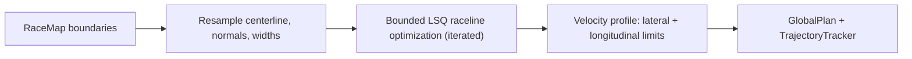
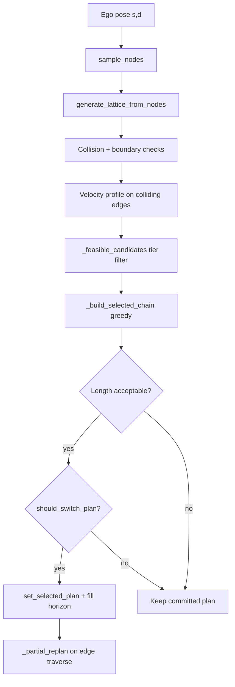

# Algorithms

This page describes the built-in **planning** and **control** algorithms in AVLite: how they fit together, how the greedy lattice local planner works, Pure Pursuit and Follow the Gap, and which YAML parameters control behavior.

Configuration lives in [`configs/c20_planning.yaml`](../configs/c20_planning.yaml) and is validated by [`PlanningSettings`](../avlite/c20_planning/c29_settings.py). See [Settings naming](settings-naming.md) for key prefixes and GUI tooltips.

## Planning in the stack

Planning runs after perception (optional) and before control:

```
Global planner  →  Local planner  →  Controller
     ↓                    ↓
 GlobalPlan          LocalPlan (trajectory)
```

The **global planner** produces a reference route with lane boundaries and a velocity profile. The **local planner** reacts to nearby agents each replan cycle and outputs a short-horizon trajectory the controller tracks.

| Role | Class | Module |
|------|-------|--------|
| Global (race track) | `GlobalCenterlineRacePlanner` | [`c25_global_race_planners.py`](../avlite/c20_planning/c25_global_race_planners.py) |
| Global (raceline optimization) | `GlobalRacePlanner` | [`c25_global_race_planners.py`](../avlite/c20_planning/c25_global_race_planners.py) |
| Global (HD map) | `HDMapGlobalPlanner` | [`c24_global_hdmap_planners.py`](../avlite/c20_planning/c24_global_hdmap_planners.py) |
| Local (lattice) | `GreedyLatticePlanner` | [`c28_local_lattice_planners.py`](../avlite/c20_planning/c28_local_lattice_planners.py) |
| Local (velocity only) | `VelocityLocalPlanner` | [`c28_local_behavioral_and_velocity_planners.py`](../avlite/c20_planning/c28_local_behavioral_and_velocity_planners.py) |

Select the local planner in the GUI or profile (`local_planner_strategy_name` in execution config). **`GreedyLatticePlanner`** is the default reactive planner for obstacle avoidance and overtaking.

---

## Global planning

### Race centerline (`GlobalCenterlineRacePlanner`)

Used on closed race tracks with a `RaceMap` (left/right boundary polylines).

- Extracts a centerline between boundaries.
- Assigns a curvature-based velocity profile along the path.
- Outputs a `GlobalPlan` with `left_boundary_d`, `right_boundary_d`, and a `TrajectoryTracker` reference — all consumed by the lattice.

### Optimized raceline (`GlobalRacePlanner`)

Computes a **raceline** inside the corridor instead of following the centerline: it minimizes a blend of curvature and path length subject to the track boundaries, then profiles velocity with lateral **and** longitudinal acceleration limits. Input is a `RaceMap` (same corridor as the centerline planner).

The formulation follows published work: the curvature/length blend is the racing-line compromise of Braghin et al. [1], and the iteratively re-linearized lateral-offset QP with a forward-backward velocity solver is the minimum-curvature approach of Heilmeier et al. [2] (TUM / Roborace), simplified here to a box-bounded least-squares problem.



**Raceline optimization.** The corridor centerline is resampled to uniform arc-length spacing and the raceline is parametrized by a lateral offset \(\alpha_i\) along the unit left normal \(n_i\) at each reference point \(c_i\):

\[
p_i = c_i + \alpha_i \, n_i
\]

Both \(x(\alpha)\) and \(y(\alpha)\) are affine in \(\alpha\), so the objective is a linear least-squares residual. With arc-length-normalized first/second difference operators \(D_1\) (\(\approx\) tangent) and \(D_2\) (\(\approx\) curvature), the planner minimizes

\[
w \left( \lVert D_2 x(\alpha) \rVert^2 + \lVert D_2 y(\alpha) \rVert^2 \right)
+ (1 - w) \left( \lVert D_1 x(\alpha) \rVert^2 + \lVert D_1 y(\alpha) \rVert^2 \right)
\]

where \(w =\) `c25_curvature_weight` blends **minimum curvature** (\(w = 1\), smooth and fast) against **shortest path** (\(w = 0\), tight corner cutting). The offsets are box-bounded to the corridor minus the boundary margin \(m =\) `c20_boundary_margin`:

\[
-(w_{\text{right},i} - m) \le \alpha_i \le w_{\text{left},i} - m
\]

The problem is solved as a box-bounded sparse quadratic program (L-BFGS-B on the banded normal equations, `scipy.optimize.minimize`); `c25_optimization_iterations` outer iterations re-resample the raceline and re-linearize normals and bounds around the previous solution. Closed tracks are detected automatically and use periodic difference operators so the raceline is seamless across the start/finish line. Progress (loading, per-iteration solve time, velocity profile, estimated lap time) is logged at info level.

**Velocity profile.** Three constraints are applied in sequence over \(v^2\):

1. lateral limit: \(v_i = \min\!\big(v_{\max}, \sqrt{a_{\text{lat}} / |\kappa_i|}\big)\)
2. forward pass (acceleration): \(v_{i+1}^2 \le v_i^2 + 2\, a_{\text{accel}}\, \Delta s\)
3. backward pass (braking): \(v_i^2 \le v_{i+1}^2 + 2\, a_{\text{brake}}\, \Delta s\)

On closed tracks the passes iterate with wrap-around so the profile is consistent across the seam.

**Output.** A `GlobalPlan` with the raceline path, velocity profile, a `TrajectoryTracker`, and per-waypoint `left_boundary_d` / `right_boundary_d` offsets **relative to the raceline** (margin-inset), so the lattice local planner works unchanged.

| Key | Default | Description |
|-----|---------|-------------|
| `c25_max_velocity` | `75.0` | Top speed on straights (m/s), ~270 km/h |
| `c25_max_lateral_accel` | `25.0` | Lateral acceleration limit for the curvature speed cap (m/s²), ~2.5 g |
| `c25_max_longitudinal_accel` | `10.0` | Acceleration limit for the forward velocity pass (m/s²), ~1 g |
| `c25_max_braking_decel` | `25.0` | Braking limit for the backward velocity pass (m/s²), ~2.5 g |
| `c25_curvature_weight` | `0.75` | Objective blend: `1` pure minimum curvature, `0` pure shortest path |
| `c25_optimization_iterations` | `3` | Outer re-linearization iterations |

Defaults are sized for a **Dallara Super Formula** platform (high-downforce open-wheeler). For a low-speed test vehicle use e.g. `c25_max_velocity: 10`, `c25_max_lateral_accel: 5`, `c25_max_longitudinal_accel: 3`, `c25_max_braking_decel: 5`.

**References**

1. F. Braghin, F. Cheli, S. Melzi, and E. Sabbioni, "Race driver model," *Computers & Structures*, vol. 86, no. 13–14, pp. 1503–1516, 2008. [doi:10.1016/j.compstruc.2007.04.028](https://doi.org/10.1016/j.compstruc.2007.04.028)
2. A. Heilmeier, A. Wischnewski, L. Hermansdorfer, J. Betz, M. Lienkamp, and B. Lohmann, "Minimum curvature trajectory planning and control for an autonomous race car," *Vehicle System Dynamics*, vol. 58, no. 10, pp. 1497–1527, 2020. [doi:10.1080/00423114.2019.1631455](https://doi.org/10.1080/00423114.2019.1631455)

!!! tip "Tuning notes"
    - **Raceline clips corners too aggressively** — raise `c25_curvature_weight` toward `1` (smoother, higher-speed line) or increase `c20_boundary_margin`.
    - **Raceline too conservative / long** — lower `c25_curvature_weight` toward `0` for a shorter line.
    - **Wobbly line on noisy boundaries** — more `c25_optimization_iterations` help the linearization converge; the uniform resampling also filters boundary noise.
    - **When to prefer the centerline planner** — very narrow corridors (little room to optimize) or when downstream components assume the reference is equidistant from both boundaries.

### HD map (`HDMapGlobalPlanner`)

Used with OpenDRIVE maps: `HDMap` in [`c11_perception_model.py`](../avlite/c10_perception/c11_perception_model.py), parsed by [`c18_hdmap_parser.py`](../avlite/c10_perception/c18_hdmap_parser.py).

- Routes on the lane graph from start to goal.
- Produces the same `GlobalPlan` structure (path, boundaries, velocity) for downstream local planning.

---

## Velocity local planner

`VelocityLocalPlanner` follows the **global path geometry** and adjusts **speed** when obstacles block the way.

- **`replan`** clones the global trajectory window and calls `profile_trajectory` to apply speed limits.
- **`apply_speed_match`** decelerates toward an agent’s speed at a collision waypoint — used when an edge is marked colliding.

When paired with the lattice planner, velocity profiling runs on colliding edges **before** edge selection so the planner can compare deceleration profiles. It can also be selected as the sole local planner for simpler follow-the-leader behavior without lateral sampling.

---

## Greedy lattice planner

`GreedyLatticePlanner` extends `LatticePlanningStrategy`. It builds a **Frenet lattice** along the global reference, evaluates candidate maneuvers, commits to a **chain of edges**, and extends that chain as the ego moves.

Implementation lives in:

- [`c28_local_lattice_planners.py`](../avlite/c20_planning/c28_local_lattice_planners.py) — node sampling, edge generation, boundary checks, plus selection, commitment, and replan logic

### Coordinate frame

Planning uses Frenet coordinates relative to the global trajectory:

- **`s`** — arc length along the reference
- **`d`** — lateral offset (positive = left of reference)

Each **node** is a `(s, d)` sample. Each **edge** connects two nodes and is shaped as a quintic polynomial in `(s, d)`, converted to a `TrajectoryTracker` with position and velocity.

### Output: edge chain

The planner does not expose a single edge. It commits to a linked list:

```
selected_local_plan → selected_next_local_plan → … → None
```

`set_selected_plan` concatenates all edge trajectories into `_committed_trajectory`, which `get_local_plan()` returns to the controller. Waypoint sync advances along this single polyline.

### Replan pipeline

Each full `replan` cycle:



1. **Sample nodes** at longitudinal stations spaced by `c28_maneuver_distance`.
2. **Generate edges** between consecutive levels (fully connected graph).
3. **Check** each edge for collision and boundary violation; profile velocity on colliding edges.
4. **Filter** to feasible candidates (tiered — see below).
5. **Build chain** greedily from level-0 edges forward.
6. **Accept / switch** only if length rules and `should_switch_plan` allow it.
7. **Fill horizon** via `_partial_replan` until the chain has `c28_planning_horizon` edges.

When the ego finishes traversing an edge, `_on_edge_traversed` calls `_partial_replan` to append one new edge at the tail (sliding window).

### Lattice construction

From [`Lattice.sample_nodes`](avlite/c20_planning/c28_local_lattice_planners.py):

| Level | Content |
|-------|---------|
| 0 | Ego start node at current `(s, d)` |
| 1 … `planning_horizon` | One node on the reference line (`d` from global path) plus `sample_size − 1` random lateral nodes |

Lateral nodes are sampled uniformly between lane boundaries minus `c28_boundary_clearance`.

[`generate_lattice_from_nodes`](avlite/c20_planning/c28_local_lattice_planners.py) connects **every** node at level `l` to **every** node at level `l + 1`, producing a dense candidate set. Level-0 outgoing edges are stored in `lattice.level0_edges`.

**Obstacle prediction** for collision checking spans the full lattice horizon:

\[
T_{\text{pred}} = \frac{\text{planning\_horizon} \times \text{maneuver\_distance}}{v_{\text{ego}}}
\]

Ahead agents with `|v| > c20_min_velocity_threshold` get swept polygons from `pm.prediction` over that horizon; slower or behind agents use their current inflated footprint only.

### Edge feasibility

Each edge is evaluated on three axes:

| Check | Meaning | Where stored / computed |
|-------|---------|-------------------------|
| **Collision** | Ego footprint intersects an agent polygon along the edge | `edge.collision`, `edge.collision_idx`, `edge.collision_agent_velocity` |
| **Boundary** | Any path point exits `[right_boundary + clearance, left_boundary − clearance]` | `edge.boundary_violation` |
| **Curvature** | `max_curvature(edge) ≤ a_lat / v²` with ego speed (floored at `c28_min_curvature_velocity`) | `_is_curvature_feasible()` at selection time |

Curvature uses the bicycle-model relation \(a_{\text{lat}} = v^2 \kappa\), with `c28_max_lateral_accel` as the limit.

### Candidate filtering tiers

[`_feasible_candidates`](avlite/c20_planning/c28_local_lattice_planners.py) applies strict filters first, then relaxes if nothing remains:

1. **Strict** — no collision, no boundary violation, curvature feasible.
2. **Curvature fallback** (if `c28_allow_curvature_fallback`) — collision-free and in bounds; curvature ignored.
3. **Boundary fallback** (if agent blocks ahead **or** `c28_allow_boundary_violation_fallback`) — collision-free only.

**Centerline exemption.** Within the strict tier, an edge returning to the reference (`|end.d| < c28_d0_reference_threshold`) whose lateral shift `|end.d − start.d|` is within the kinematic reach `R(v)` is treated as curvature-feasible even if the discretized `max_curvature()` marginally fails. The sampling math already deems that shift reachable, so this trusts it over the discretized measurement and keeps a stable centerline candidate available (prevents losing the plan to sampling/measurement noise). Collision and boundary checks still apply.

**Agent blocks ahead** is true when any agent is in front of the ego (by heading dot product) within the planning horizon in `s`.

When an agent blocks ahead, chain building **prefers lateral successors** with `|end.d| ≥ c28_d0_reference_threshold` so the planner keeps offset paths through an overtake instead of merging back to center too early.

### Edge selection cost

[`_select_best_edge`](avlite/c20_planning/c28_local_lattice_planners.py) picks the minimum-cost candidate:

- **Hard preference** for edges ending near the reference (`|end.d| < c28_d0_reference_threshold`) when any exist.
- **Cost** = `|end.d| + c28_safety_margin_weight × clearance_penalty` (lower clearance → higher cost).

### Plan commitment and switching

The planner avoids swapping plans every replan tick so the controller can converge on a stable reference.

**Length acceptance** (in `replan`) — a new chain is considered only if:

- No current plan and new chain has ≥ 1 edge, or
- New chain is **longer or equal**, or
- Length differs by at most **1** edge, or
- Current chain has a collision and the new chain is **clean**

**`should_switch_plan`** — even if acceptable, switching requires:

| Immediate switch | Discretionary switch |
|------------------|----------------------|
| No committed plan | Longer clean chain, or escape from colliding chain |
| Emergency-stop recovery to clean plan | Requires **wait time** (`c28_replan_wait_time`) **or** chain **+2 edges** |
| Current edge done, no successor | Same-length speed upgrade (+0.5 m/s) only after **wait time** |
| Urgent collision (within `c28_urgent_collision_threshold` m) | |
| Geometric disconnect (`> c28_disconnect_distance_threshold` m from plan) | |
| Head edge colliding, agent cleared (+0.5 m/s faster clean plan) | |
| Single-edge plan whose speed or lateral target **materially changed** | |

A clean committed chain is **not** replaced for a slightly faster resampled plan on every replan cycle. Immediate +0.5 m/s applies only when recovering from a **colliding head edge** (obstacle just cleared). Emergency passing commits also go through `should_switch_plan`.

Same-length multi-edge clean alternatives with similar speed never switch (anti-jitter).

**Single-edge refresh.** When the committed plan is a single edge (horizon could not extend), a clean single-edge candidate is committed only when its mean speed differs by more than 0.5 m/s **or** its lateral target moves by more than `c28_d0_reference_threshold`; otherwise the current edge is held. This refreshes the speed profile when it matters while preventing per-tick re-commit flicker from random resampling.

On switch, a **velocity ramp** over the first `c28_match_speed_wp_buffer` waypoints blends from ego speed into the plan when recovering from a stop.

### Emergency behavior

If no strictly feasible level-0 edges exist:

1. Retry with boundary relaxed (`agent_blocks_ahead=True` filtering) — commit only if `should_switch_plan` allows.
2. If still blocked, pick the edge with the **latest** collision index (most reaction time) only when `should_switch_plan` allows; otherwise keep the current committed chain. If the committed plan has degraded to a **single edge** and no committable plan is found for `c28_no_plan_release_ticks` consecutive replan ticks, release it to the global trajectory (`get_local_plan` then falls back to the global reference, which carries a proper speed profile).
3. If no edges are generated at all: a **multi-edge** committed trajectory decelerates to zero (emergency stop); a **single-edge** plan is released to the global trajectory after the same `c28_no_plan_release_ticks` debounce.

The debounce holds the last committed plan through transient no-feasible ticks (random sampling can momentarily find no feasible edge), so the local plan does not blink between a committed edge and the global fallback.

### Debug visualization

Enable the local lattice plot in the stack view. Edge colors in [`p69_plot_lib.py`](../avlite/plugins/p60_visualizer_tk/p69_plot_lib.py):

| Color | Meaning |
|-------|---------|
| Green (`#8ec07c`) | Feasible — no collision, in bounds, curvature OK |
| Blue | Kinematic violation — boundary and/or curvature |
| Red | Collision |

The plot draws **all** lattice edges, not only the committed chain. During overtake, **blue** edges may still be selected when boundary constraints are relaxed, so many blue lines are normal in dense traffic.

---

## Parameter reference

Defaults match [`PlanningSettings`](../avlite/c20_planning/c29_settings.py). Adjust per profile in `c20_planning.yaml`.

### Lattice geometry and sampling

| Key | Default | Description |
|-----|---------|-------------|
| `c28_planning_horizon` | `3` | Number of edges in the committed chain (maneuver segments) |
| `c28_maneuver_distance` | `30` | Longitudinal spacing between lattice levels (m) |
| `c28_sample_size` | `3` | Lateral samples per level (1 on reference + `sample_size − 1` random) |
| `c28_num_of_edge_points` | `10` | Waypoints along each quintic edge |
| `c28_boundary_clearance` | `0.5` | Inset from lane boundaries for sampling and violation checks (m) |
| `c28_d0_reference_threshold` | `0.2` | Treat `\|d\|` below this as “on reference” for selection and lateral preference (m) |
| `c28_kinematic_sampling` | `true` | Bound lateral samples to the speed-dependent kinematic reach instead of the full road width |
| `c28_sample_reach_factor` | `1.0` | Multiplier on the kinematic reach; `<1` adds curvature headroom, `>1` widens exploration |
| `c28_sample_distribution` | `1` | Sample placement in the reach band (always strictly inside the limits): `0` even spread (interior bin-centers), `1` random uniform, `2` stratified (even bins + jitter) |

**Kinematic sampling.** When `c28_kinematic_sampling` is enabled, lateral samples are drawn within a reachable band rather than uniformly across the whole road. For a quintic lateral shift `Δd` over one maneuver segment of length `L`, peak curvature is `κ ≈ 5.7735·Δd / L²`; equating this to the curvature limit `a_lat / v²` (see [Edge feasibility](#edge-feasibility)) gives the per-segment reachable half-width

\[
R(v) = \frac{a_{\text{lat,max}} \cdot L^2}{5.7735 \cdot v^2} \cdot \texttt{c28\_sample\_reach\_factor}, \quad v = \max(v_{\text{ego}}, \texttt{c28\_min\_curvature\_velocity}).
\]

The band fans out by `l·R` at level `l` (cumulative reach), centered on the ego's current `d` and clipped to the boundaries, so almost all sampled edges pass the curvature check. As speed rises, `R` shrinks (`∝ 1/v²`), automatically narrowing the spread. Set `c28_kinematic_sampling: false` to restore full-width sampling.

Each level has one node on the reference (center) plus `c28_sample_size − 1` samples placed strictly within the band (sandwiched between the limits, never on them) per `c28_sample_distribution`: `0` spreads them evenly at interior bin-centers (deterministic; the 25%/75% points for two samples), `1` draws each independently at random (uniform), and `2` is stratified (one random draw per even bin — coverage plus run-to-run variety). So `c28_sample_size = 3` yields three nodes per level: the reference plus two inside the limits.

### Feasibility and fallbacks

| Key | Default | Description |
|-----|---------|-------------|
| `c28_max_lateral_accel` | `4.0` | Lateral acceleration limit for curvature feasibility (m/s²) |
| `c28_min_curvature_velocity` | `3.0` | Speed floor used when evaluating curvature at low ego speed (m/s) |
| `c28_allow_curvature_fallback` | `false` | If strict tier is empty, allow edges that fail curvature but stay in bounds |
| `c28_allow_boundary_violation_fallback` | `false` | If still empty, allow collision-free edges outside bounds |

Boundary relaxation also applies automatically when an agent blocks ahead (overtake path).

### Replan stability

| Key | Default | Description |
|-----|---------|-------------|
| `c28_replan_wait_time` | `2.5` | Minimum time between discretionary plan switches (s) |
| `c28_urgent_collision_threshold` | `10.0` | Distance to collision before immediate switch (m) |
| `c28_disconnect_distance_threshold` | `5.0` | Max distance from plan waypoint before forced switch (m) |
| `c28_no_plan_release_ticks` | `3` | Consecutive replan ticks with no committable plan before a degraded single-edge plan is released to the global trajectory (debounces flicker from transient sampling misses) |
| `c28_min_edge_progress_to_block` | `0.2` | Min fraction of edge progress before replan blocking (reserved) |

### Selection and velocity continuity

| Key | Default | Description |
|-----|---------|-------------|
| `c28_safety_margin_weight` | `0.3` | Weight of clearance in edge cost |
| `c28_match_speed_wp_buffer` | `4` | Waypoints for velocity ramp after plan switch |
| `c20_min_ramp_start_velocity` | `3.0` | Minimum creep speed when ramping after recovery (m/s) |

### Shared collision settings (`c20_*`)

Used by lattice, velocity planner, and global boundary inset.

| Key | Default | Description |
|-----|---------|-------------|
| `c20_collision_safety_margin` | `0.3` | Extra clearance on the ego side of collision checks (m); expands the buffered trajectory corridor beyond half the ego width |
| `c20_obstacle_inflation_margin` | `0.5` | Extra clearance around agent obstacle polygons in collision checks (m); inflates each agent bbox or prediction sweep before intersecting the ego corridor |
| `c20_default_ego_velocity` | `5.0` | Assumed ego speed when velocity is unknown (m/s) |
| `c20_min_velocity_threshold` | `0.5` | Agent speed gate for collision prediction (m/s); at or below this \|v\|, agents are static and `pm.prediction` is not used for swept obstacles |
| `c20_boundary_margin` | `0.0` | Global plan boundary inset from track or HD map edges (m) |

Effective clearance between nominal vehicle bodies is approximately `c20_collision_safety_margin` (ego) plus `c20_obstacle_inflation_margin` (agents), on top of vehicle widths. Agents with `|v| ≤ c20_min_velocity_threshold` use their current footprint only; prediction sweeps apply only to ahead, moving agents.

### Velocity planner (`c27_*`)

Used by `VelocityLocalPlanner` and for speed-matching on colliding lattice edges.

| Key | Default | Description |
|-----|---------|-------------|
| `c27_max_deceleration` | `3.0` | Max deceleration magnitude used for speed profiling (m/s²) |
| `c27_stopping_safety_buffer` | `2.0` | Extra standoff distance when stopping (m) |
| `c27_follow_gap_buffer` | `0.5` | Bumper-to-bumper gap beyond vehicle lengths (m) |
| `c27_follow_cruise_min_gap` | `15.0` | Gap before deferring back to global cruise speed (m) |
| `c27_planning_horizon_points` | `50` | Waypoint window for velocity local plan from current index |

!!! tip "Tuning notes"
    - **Many blue edges at high speed** — curvature limit tightens as \(v^2\); raise `c28_max_lateral_accel` or enable `c28_allow_curvature_fallback`.
    - **Overtake not lateral enough** — check agent detection horizon; boundary relax only triggers when `_agent_blocks_ahead` is true.
    - **Plan jitter / controller never settles** — increase `c28_replan_wait_time`; discretionary switches need wait or material gain (+2 edges or +0.5 m/s).
    - **Single-edge plan flickers / blinks to the global line** — raise `c28_no_plan_release_ticks` so transient no-feasible ticks are held longer before releasing to global.
    - **Too conservative following** — reduce `c27_follow_cruise_min_gap` or collision margins (`c20_*`).

---

## Control: Pure Pursuit and Follow the Gap

Pure Pursuit is a geometric path-tracking controller. It aims the vehicle at a **lookahead point** a distance \(L_d\) ahead and steers along the circular arc that reaches that point (bicycle model):

\[
\delta = \arctan\left(\frac{2 L \sin\alpha}{L_d}\right)
\]

where \(L\) is the wheelbase (`c32_ego_distance_front_axle`) and \(\alpha\) is the bearing of the lookahead point in the ego frame (x forward, y left).

Configuration lives in [`ControlSettings`](../avlite/c30_control/c39_settings.py) (`c35_*` keys). Select the controller via `c40_controller`.

| Class | Module | Lookahead source |
|-------|--------|------------------|
| `PurePursuitController` | [`c35_pure_pursuit.py`](../avlite/c30_control/c35_pure_pursuit.py) | Global/local path at arc-length \(L_d\) |
| `FollowTheGapController` | same | Path-biased forward LiDAR free gap at range \(L_d\) |

### Path Pure Pursuit (`PurePursuitController`)

Requires a plan (global or local) and localization. Finds the ego’s progress \(s\) on the trajectory, takes the path point at \(s + L_d\), transforms it into the ego frame, and applies the formula above. Velocity tracks the trajectory waypoint with a PID (same emergency / anti-windup pattern as Stanley).

### Follow the Gap (`FollowTheGapController`)

Requires LiDAR (`LIDAR_2D` or `LIDAR_3D`) and localization; a plan is optional. The executer passes a `SensorFrame`; the controller reads `sensors.lidar`. World-frame hits are squashed to 2D (optional z-band), transformed into the ego frame, and points inside `c35_bubble_radius` are dropped. In the forward half-plane (`x>0`), the controller finds angular gaps between consecutive returns. Interior gaps are preferred over the ±90° FOV-edge candidates. When a trajectory is available, among gaps at least `c35_min_gap_width` wide it picks the mid-bearing closest to the path lookahead; otherwise it picks the widest interior gap. A Pure Pursuit target is placed at that bearing and distance \(L_d\).

Without a plan, speed tracks `c35_cruise_velocity`; with a plan, waypoint velocity is used (steering still comes from the gap).

### Pure Pursuit / Follow the Gap parameters

| Key | Default | Role |
|-----|---------|------|
| `c35_lookahead_distance` | `8.0` | Fixed \(L_d\) (m) when speed gain is 0 |
| `c35_min_lookahead` / `c35_max_lookahead` | `3.0` / `20.0` | Clamps for speed-adaptive \(L_d\) |
| `c35_lookahead_speed_gain` | `0.0` | If > 0: \(L_d = \mathrm{clip}(k\cdot v, \min, \max)\); if 0: use fixed distance |
| `c35_valpha` / `vbeta` / `vgamma` | `0.8` / `0.01` / `0.3` | Velocity PID gains |
| `c35_cruise_velocity` | `5.0` | Follow-the-Gap cruise speed (m/s) when no plan |
| `c35_lidar_z_min` / `c35_lidar_z_max` | `-1.5` / `2.0` | Height band (m) for 3D → 2D squash |
| `c35_bubble_radius` | `1.0` | Drop ego-frame hits closer than this (m) before gap finding |
| `c35_min_gap_width` | `0.2` | Min angular gap (rad) for path-biased selection |

---

## Related reading

- [Architecture](architecture.md) — stack layers and data flow
- [Settings naming](settings-naming.md) — YAML key prefixes and validation
