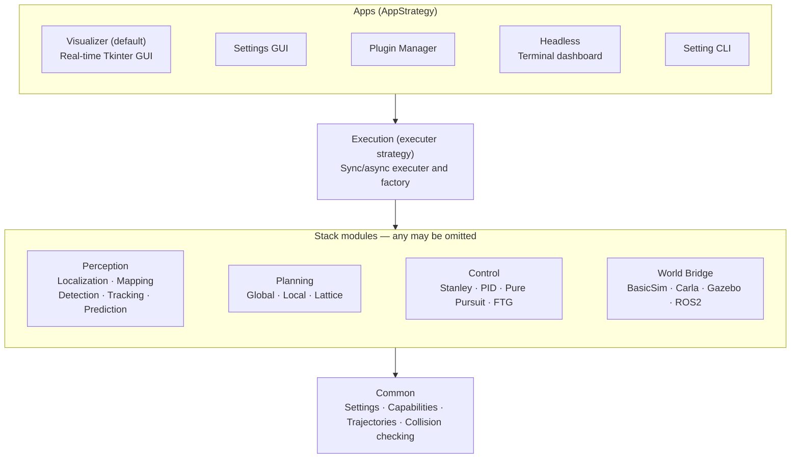
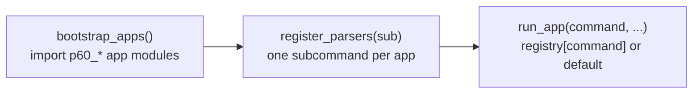

# Architecture

## Overview

AVLite follows a layered architecture with clear separation between interfaces and implementations. Every layer is extendable: apps, executers, perception/planning/control strategies, world bridges, and execution tasks (`TaskStrategy`) as an orthogonal stack extension are all auto-registered strategies, and any of them can be added or overridden by a plugin.

### Flexible composition (not only a pipeline)

The classic bridge → localize → perceive → plan → control flow is the **default shape**, not a requirement.

- **Any stack module can be omitted** — leave the class name empty in the profile (`c40_perception`, `c40_localization`, `c40_mapping`, `c40_global_planner`, `c40_local_planner`, `c40_controller`). Perception is not special; planning and control can be empty too.
- **End-to-end plugins** are first-class: register in the slot that matches what you *produce*, declare `world_requirements` / `stack_requirements` / `stack_capabilities`, and read `sensors` (and optional `perception_model`) inside that strategy. You do not have to follow a traditional pipelined stack.
- Examples:
  - **Sensors → control** — a `ControlStrategy` with e.g. `world_requirements = {LIDAR_2D}` and `stack_capabilities = {CONTROL}`, perception and planning left empty: reactive control from the `SensorFrame`.
  - **Sensors → local plan** — a `LocalPlanningStrategy` that consumes sensors and advertises `LOCAL_PLAN`, with no separate perception module.
- Assembly still validates hard requirements against available capabilities (world-bridge ground truth can satisfy some stack needs). Details: [Capability System](#capability-system).



Every box above the Common layer is a pluggable strategy: apps register via `AppStrategy`, and the stack modules (perception, planning, control, world bridge) plus the executer and `TaskStrategy` tasks register via their own strategy base classes. See [Strategy Pattern with Auto-Registration](#strategy-pattern-with-auto-registration) and [Execution Tasks](execution-tasks.md).

## Design Patterns

### Strategy Pattern with Auto-Registration

All major components use abstract base classes with automatic registration:

```python
class PerceptionStrategy(ABC):
    registry = {}
    
    def __init_subclass__(cls, abstract=False, **kwargs):
        super().__init_subclass__(**kwargs)
        if not abstract:
            PerceptionStrategy.registry[cls.__name__] = cls
```

When you create a subclass, it automatically registers itself and appears in the UI dropdowns. No manual registration needed.

### App Strategy (CLI/GUI entry points)

Every entry point — the Tkinter visualizer, the settings GUI, the plugin manager, the headless runner, the setting CLI — is just an *app*: an `AppStrategy` subclass that auto-registers exactly like `PerceptionStrategy`, keyed by `cli_name` (`None` marks the default app that runs when no subcommand is given).

```python
class MyToolApp(AppStrategy):
    cli_name = "my-tool"        # None = default app
    help = "Short description for avlite --help"

    def run(self, args, unknown):
        ...
        return 0                 # optional; None = exit 0
```

The Tk visualizer and headless dashboard carry no special status — they are two of several built-in apps, and new apps drop in the same way (subclass, set `cli_name`, implement `run()`, optionally `configure_parser()` for flags). At startup [`__main__.py`](../avlite/__main__.py) drives the dispatch:



Built-in apps ship as `p60_*` plugins (`p60_visualizer_tk`, `p60_headless_mode`, `p60_setting_cli`), so the app layer is fully extendable — community plugins can register their own apps. See [Plugin Development → Apps](plugin-development.md#apps-appstrategy).

### Capability System

Components declare what they require and provide along a clean 2x2 grid keyed on capability space (world/sensor vs stack) and direction (requires vs provides):

| | requires | provides |
| --- | --- | --- |
| **World layer** (`WorldCapability`) | `world_requirements` | `world_capabilities` (world bridge only) |
| **Stack layer** (`StackCapability`) | `stack_requirements` | `stack_capabilities` |

- A **strategy** declares `world_requirements`, `stack_requirements`, and `stack_capabilities` (what it produces). Strategy ABCs keep these as **abstract** `@property`; leaf concretes satisfy them with public **`frozenset` class attributes** (readable without constructing an instance). Pipelines keep instance `@property` aggregators over their stages.
- A **world bridge** declares `world_capabilities` (sensors it exposes) and `stack_capabilities` (ground truth it provides).

Requirement entries may be plain capabilities or wrappers:

- **Plain caps (AND)** — every listed capability must be present (`all · A & B` in the visualizer popup).
- **`AnyOf(A, B, …)`** — hard OR: at least one member must be present (`any · A | B`).
- **`MayUse(A, B, …)`** — soft: never blocks assembly; the module uses these when available (`optional · A | B`).

**Runtime payloads (who passes what):** capability enums declare *need*; they are not a message bus. Key strategy methods also take optional ``perception_model`` + ``sensors`` (supplied by the executer, pipeline, or UI) **in addition to** any method-specific args:

```python
# Shared optional pair on every key method
perception_model=None,  # stack world-state (PerceptionModel)
sensors=None,           # world SensorFrame

# Control keeps its prior args as well:
control(ego, plan=None, control_dt=None, perception_model=None, sensors=None)

# Detect keeps optional unpacked sensor convenience args as well:
detect(perception_model=None, sensors=None, rgb_img=None, depth_img=None, lidar_data=None)
```

Modules read fields they need (e.g. `sensors.lidar`, or `ego` / `plan` on control). Global start/goal stay via `set_start_goal` before `plan(...)`.

```python
class MyPerception(PerceptionStrategy):
    world_requirements = frozenset({WorldCapability.CAMERA_RGB})
    stack_requirements = frozenset()
    stack_capabilities = frozenset({StackCapability.DETECTION})


class MyLocalPlanner(LocalPlanningStrategy):
    world_requirements = frozenset()
    stack_requirements = frozenset({
        StackCapability.GLOBAL_PLAN,
        StackCapability.LOCALIZATION,
        MayUse(StackCapability.DETECTION, StackCapability.PREDICTION),
    })
    stack_capabilities = frozenset({StackCapability.LOCAL_PLAN})
```

**World Capabilities** (sensors / actuation the bridge provides):

- `CAMERA_RGB` - RGB camera images
- `CAMERA_DEPTH` - Depth camera images
- `LIDAR_3D` - 3D LiDAR point cloud data
- `LIDAR_2D` - 2D LiDAR scanner data
- `RADAR` - Radar sensor data
- `WHEEL_ENCODER` - Wheel encoder for odometry
- `IMU` - Inertial measurement unit
- `GNSS` - GNSS / GPS receiver
- `AGENT_SPAWN` - Bridge can spawn NPC agents
- `AGENT_CONTROL` - Bridge can actuate spawned NPC agents via `control_agent` (opt-in; separate from `AGENT_SPAWN`)

A bridge declaring `CAMERA_RGB` or `CAMERA_DEPTH` must also populate `SensorFrame.camera_params` via `get_camera_params()`. LiDAR from the WorldBridge is already in the [map / global frame](#coordinate-system); an image cannot be, so the camera intrinsic and per-frame world-to-camera extrinsic are what let a fusion strategy project those points into the image. See [Plugin Development → Frames vs ROS TF](plugin-development.md#frames-vs-ros-tf) and [Camera geometry](plugin-development.md#camera-geometry).

**Stack Capabilities** (`StackCapability`) — what a stack module produces, used both as a module's `stack_capabilities` and as another module's `stack_requirements`:

- `DETECTION` - Object detection
- `TRACKING` - Object tracking
- `PREDICTION` - Motion prediction
- `LOCAL_PLAN` - Local plan (produced by the local planner)
- `GLOBAL_PLAN` - Global plan (produced by the global planner)
- `CONTROL` - Control commands (produced by the controller)
- `LOCALIZATION` - Ego localization
- `MAP_HD` - HD / OpenDRIVE map (from a mapping module such as `MapReader`)
- `MAP_RACE_TRACK` - Race-track corridor map (from a mapping module such as `MapReader`)
- `SLAM` - Simultaneous localization and mapping

**Ground truth via the world bridge:** a `WorldBridge` may advertise `stack_capabilities` (a `set[StackCapability]`, default empty) to satisfy downstream `stack_requirements` without a real module. For example, `BasicSim` provides `{DETECTION, TRACKING, LOCALIZATION}` as ground truth and declares `stack_requirements = {CONTROL}`. Optional `WorldBridge.map` is simulation-only (e.g. LiDAR geometry) and does **not** advertise `MAP_HD` / `MAP_RACE_TRACK`. Typed stack map caps come from a mapping module such as `MapReader` (holds a pre-loaded `Map`; advertises `MAP_HD` or `MAP_RACE_TRACK` from the concrete type; format sniff/load stays on `Map.open` / `Map.from_path`). Global planners require the matching typed cap (`HDMapGlobalPlanner` → `MAP_HD`; race planners → `MAP_RACE_TRACK`). The executer’s `available_stack_capabilities()` unions every present module’s `stack_capabilities` with filtered `world.stack_capabilities`. At stack build it **raises** when a module’s hard `stack_requirements` are unmet (`MayUse` never fails that check), and **warns** when the world’s hard requirements are unmet or when the same capability is provided by more than one source.

In the visualizer, the ⓘ button (or right-click) on a stack Combobox opens a contract popup: world requirements, stack requirements (colored against `available_stack_capabilities`, including world GT), and provided stack capabilities. The Bridge Setting Combobox has the same ⓘ for the selected `WorldBridge`: world capabilities, stack requirements, and stack capabilities. Requirement rows are labeled `all ·` / `any ·` / `optional ·`. Provided caps: green = consumed by another module’s hard or soft (`MayUse`) requirements or by the world bridge’s `stack_requirements`; orange = also provided by another top-level module or by world GT when that capability is checked under Bridge Setting’s stack column (`c41_world_stack_capabilities`); gray = unused. Parent `PerceptionPipeline` advertising does not orange its own detect/track/predict stages. Velocity and lattice local planners soft-use `DETECTION` and `PREDICTION` (agents + motion sweeps), not `TRACKING`. Bridge Setting’s world column (`c41_world_capabilities`) gates which sensors are fed into `SensorFrame`.
### Factory Pattern

The executor factory assembles components based on configuration:

```python
executer = executor_factory(
    bridge="BasicSim",
    perception_strategy_name="MultiObjectPredictor",
    localization_strategy_name="MyLocalization",
    mapping_strategy_name="MapReader",
    local_planner_strategy_name="GreedyLatticePlanner",
    controller_strategy_name="StanleyController"
)
```

It loads plugins, opens `ExecutionSettings.c40_map` once via `Map.open` (shared by `MapReader`, global planners, and `WorldBridge`), instantiates strategies from registries, and wires everything together. **Any** strategy slot may be empty or omitted (perception, localization, mapping, global/local planner, controller) to run without that module — see [Flexible composition](#flexible-composition-not-only-a-pipeline).

Before calling `executor_factory()`, load YAML profiles with `load_stack_settings(profile, load_plugins)` in [`c62_factory.py`](../avlite/c60_apps/c62_factory.py). Each setting reads its section from the single `configs/<profile>.yaml`: it loads the c10–c40 layer sections, `AppSettings` (the `c69_apps` section), and built-in plugin settings (the `plugins` section); the GUI loads the Tk `VisualizationSettings` binder separately.

### Layer import rules

Stack core (`c10`–`c40`, `c50_common`) may import `c61_app_strategy`, `c64_settings_schema`, `c68_paths`, and `c69_settings` only. Profile export/import operates on a single per-profile YAML file (`c65_setting_utils.export_profile` / `import_profile`), with checkboxes to include the `c69_apps` and `plugins` sections. Tk binder `VisualizationSettings` lives in plugin `settings.py`; `c69_settings` is schema-only (plugin bootstrap fields use `c62_*`, consumed by `c62_factory`).

### Agent model

Agents are represented as a small class hierarchy in c11:

```
State → AgentState → EgoState
```

- **`EGO_AGENT_ID = 0`** — reserved for the ego vehicle (`perception_model.ego_vehicle`).
- **NPC ids `1, 2, 3, …`** — assigned by `PerceptionModel.add_agent_vehicle`.
- **`AgentType`** — platform metadata on each agent (Ackermann, diff-drive, aerial, pedestrian, …).
- **Default state** — pose (`x`, `y`, `z`, `theta`) plus scalar `velocity` (car-centric; used by planning, collision, and viz).
- **Future** — specialized subclasses (e.g. `DroneAgentState`) when kinematics need body velocity or 3D integration; see [Multi-robot agents and control](plugin-development.md#7-multi-robot-agents-and-control).

#### Coordinate system

The stack has one global frame: **map** (also called world). `EgoState.x/y/z`, plans, collision, GNSS `map_*`, and **lidar from the WorldBridge** all use the same numbers.

`theta = 0` faces +x and increases counter-clockwise (right-handed); `z` is up when used. This is the map’s local XY (OpenDRIVE local or race-boundary JSON), not WGS84 and not a vehicle-ENU frame. `c40_reference_point` is the optional WGS84 origin of that XY.

**WorldBridge lidar** — primary `sensors.lidar` and any lidar in `additional_frames` — is already in this global frame. The bridge applies the scanner mount (and, in simulation, ego pose). The stack does not transform a cloud out of `lidar_link`.

Other frames still appear, but they are not a TF tree:

- **ego / body** — +x along heading; a module derives it when it needs it (e.g. Follow the Gap).
- **camera optical** — OpenCV; `CameraParams.world_to_camera`.
- **IMU sensor** — accel / gyro as reported (not baked into map).
- **Frenet (s, d)** — planning overlay on the global path, not a sensor frame.

ROS-style lookup of link frames is not part of the stack contract. The WorldBridge composes sensors once per tick; see [Plugin Development → Frames vs ROS TF](plugin-development.md#frames-vs-ros-tf).

Control actuation is a separate layer: `ControlCommandBase` subclasses and default `AgentType` → command mapping in c31. The car stack still uses the `ControlCommand` alias for `AckermannControlCommand`.

## Layers

### **Perception**

Monolithic or pipelined detect/track/predict strategies, plus localization and mapping interfaces. Built-in algorithms and plugin implementations register automatically and appear in UI dropdowns; leave the slot empty like any other module when unused. Static map types (`Map`, `RaceMap`, `HDMap`) live in c11; OpenDRIVE parsing is in c18. See [Plugin Development](plugin-development.md) for monolithic vs pipeline extension paths.

### **Planning**

Global route planning and reactive local planning (lattice-based). Produces trajectories for the controller. Either planner slot can be omitted, or a local planner can consume sensors end-to-end without a separate perception module. See [Algorithms](algorithms.md) for lattice planner details.

### **Control**

Vehicle control strategies (Stanley, PID, Pure Pursuit, Follow the Gap) output actuation commands. A controller can also be an end-to-end plugin (sensors → actuation) when perception/planning are omitted. Commands use a `ControlCommandBase` hierarchy (`AckermannControlCommand`, `DiffDriveControlCommand`, `BodyVelocityControlCommand` in c31); the built-in car stack still returns `ControlCommand` (Ackermann alias). Per-agent command type defaults are mapped from `AgentType` in c31. See [Plugin Development → Multi-robot agents and control](plugin-development.md#7-multi-robot-agents-and-control). Pure Pursuit and Follow the Gap are documented in [Algorithms](algorithms.md#control-pure-pursuit-and-follow-the-gap).

### **Execution**

World bridge (simulator/ROS interface), executer orchestration loop, sync/async scheduling, and the factory that wires the stack from YAML configuration. The built-in `BasicSim` bridge ships with the core stack; CARLA, Gazebo, and ROS2 are supported through optional world-bridge plugins. Alternative executers (for example a multiprocess ROS deployment) are selected via `c40_executer_type` and provided as optional plugins.

After each stack tick, [`TaskRunner`](../avlite/c40_execution/c43_task_strategy.py) runs [`TaskStrategy`](../avlite/c40_execution/c43_task_strategy.py) instances listed in `c40_execution_tasks` — an orthogonal extension layer for mission logic, supervision, and instrumentation around the drive stack, not a second planner. Stack modules can stamp optional `stack_event` on `PerceptionModel`, plans, or control commands; the executer harvests those into `task_runner.notify`. See [Execution Tasks](execution-tasks.md#raising-events).

### **Apps**

CLI and GUI entry points, each an `AppStrategy` (see [App Strategy](#app-strategy-cligui-entry-points)). Built-in apps ship as `p60_*` plugins and the layer is extendable:

- **Visualizer** (default, `avlite`) — Tkinter GUI: real-time plots, profile/config management, schema tooltips, thread-safe log filtering (Core / Plugins / per-layer toggles), and plugin settings.
- **Settings GUI** (`avlite setting`) — full stack settings editor window.
- **Plugin Manager** (`avlite plugins`) — browse, install, and register community plugins.
- **Headless** (`avlite headless`) — runs the same YAML profile with a terminal dashboard, no GUI.
- **Setting CLI** (`avlite setting-cli`) — validate/describe/import/export profiles from the terminal.

### **Common**

YAML profile load/save, hot reload, plugin discovery (`c63_plugins`), path resolution (`c68_paths`), capability enums, canonical sensor layouts (rgb, depth, camera_params, lidar, imu, gnss between bridge and perception), collision checking, and settings validation (`c64_settings_schema`).

## Data Flow

The **typical** pipeline (any stage may be skipped or collapsed into one plugin via [capabilities](#capability-system)):

```
World Bridge → SensorFrame → Localization / Perception → PerceptionModel → Planning → Control
```

```
World Bridge
    │
    ├─► Sensor Data ──► Localization ──► Ego Pose (updated in-place)
    │                                          │
    ├─► Sensor Data ──► Perception ───► Agents │
    │                                          ▼
    │                              Local Planner
    │                                          │
    │                                          ▼
    │                              Trajectory
    │                                          │
    │                                          ▼
    │                              Controller
    │                                          │
    └─────────────── Control Command ◄─────────┘
                          │
              (future: control_agent for NPC fleet)
```

1. **World Bridge** provides sensor data (IMU, LiDAR, camera, ground truth)
2. **Localization** (if configured) estimates the ego pose from sensor data, updating `PerceptionModel.ego_vehicle` in-place
3. **Perception** (if configured) detects/tracks/predicts surrounding agents
4. **Local Planner** (if configured) generates a trajectory; may read sensors directly when used end-to-end
5. **Controller** (if configured) computes actuation; may read sensors directly when used end-to-end
6. **World Bridge** executes control command via `control_ego_state` (ego path unchanged; `control_agent` and `step()` hooks exist for future multi-agent and sub-stepping)
7. **TaskRunner** runs configured execution tasks after the tick (stack extension: mission, supervision, instrumentation) — see [Execution Tasks](execution-tasks.md)

## Plugin System

```
avlite/
└── plugins/            # Built-in (core team)
    ├── p60_visualizer_tk/   # visualizer + config + plugins Tk apps
    ├── p60_setting_cli/
    └── p60_headless_mode/

~/.local/share/avlite/plugins/   # Community (installed)
└── my_plugin/
    ├── __init__.py
    ├── settings.py
    └── ...

~/.config/avlite/plugin_my_plugin.yaml   # Community plugin settings (user config, not in install dir)
```

**Load order:** [`c63_plugins`](../avlite/c60_apps/c63_plugins.py) discovers and imports built-in / community / member packages into the `avlite.plugins` namespace; the factory (`c62_factory`) syncs the active profile’s plugin lists when building the stack; subclasses of strategy ABCs auto-register on import. The built-in `p60_*` packages are the apps themselves (`AppStrategy` entry points); `bootstrap_apps()` in `c61_app_strategy` imports them at startup so their apps register before CLI parsing.

See [Plugin Development](plugin-development.md) for creating community plugins, pNx naming, and log filtering.
