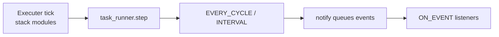

# Execution Tasks (TaskRunner)

## Why tasks exist

The stack — localize, perceive, plan, control (or an end-to-end plugin in one of those slots) — answers **how the vehicle thinks and acts each tick**. That core should stay focused and swappable.

**Execution tasks** are an **orthogonal extension** of that same running stack. They hang off the executer after each tick: they observe state, react to domain events, and drive side behaviors — without replacing perception, planning, or control, and without forking the pipeline into a second planner.

The point of the mechanism is what you can grow **around** a stable stack:

- Mission and scenario supervisors (start/stop episodes, phase transitions)
- Safety watchdogs and policy gates
- Logging, metrics, and research instrumentation
- Human-in-the-loop or experiment hooks
- Multi-step episode control and reacting to plan/control failure events

Tasks compose via schedules and [`StackEvent`](#stackevent-catalog) notifications so experiment and mission logic can evolve while the drive stack stays clean. Built-ins shipping today are **minimal illustrations** of the wiring; the interesting work lives in plugin tasks.

Tasks **extend** the stack. They are not a second planning stack.

## Where they sit on the tick

After the configured stack tick, the thin [`TaskRunner`](../avlite/c40_execution/c43_task_strategy.py) on `executer.task_runner` runs:

```text
… stack tick …
task_runner.step(self)
```

See [`c44_sync_executer.py`](../avlite/c40_execution/c44_sync_executer.py) and [`c45_async_threaded_executer.py`](../avlite/c40_execution/c45_async_threaded_executer.py). Plugin authors subclass [`TaskStrategy`](../avlite/c40_execution/c43_task_strategy.py); the factory wires class names from `c40_execution_tasks`.



## Schedules

| Schedule | When it runs |
|----------|----------------|
| `EVERY_CYCLE` | Once per `task_runner.step` |
| `INTERVAL` | When `executer.elapsed_sim_time` advances by at least `interval_s` since the last fire |
| `ON_EVENT` | When `task_runner.notify(event)` delivers an event listed in `listen_events` |

### `notify` semantics

- **During** `task_runner.step`: events are queued and flushed after CYCLE/INTERVAL tasks in that same step.
- **Outside** `step` (lifecycle, plan harvest, headless start): ON_EVENT listeners run immediately.

Call sites use `executer.task_runner.notify(event)` — there is no `ExecutionStrategy.notify`.

## Raising events

Three ways events reach `TaskRunner`. Prefer stamping artifacts from stack modules so strategy APIs stay free of `task_runner`.

### 1. Stamp on a stack artifact (perceive / plan / control)

Set optional `stack_event` on the model or command you already write. The executer harvests after that step (`notify` once, then clear to `None`):

| Artifact | When harvested |
|----------|----------------|
| `PerceptionModel.stack_event` | After localization or perception |
| `LocalPlan` / `GlobalPlan.stack_event` | After replan |
| `ControlCommandBase.stack_event` (any control command) | After control |

```python
# Inside perceive / localize — mutate the shared PerceptionModel
perception_model.stack_event = StackEvent.PARKING_ZONE_ENTERED

# Inside replan — stamp the plan you return / store
local_plan.stack_event = StackEvent.LOCAL_PLAN_FAILED

# Inside control — stamp the command you return
cmd = AckermannControlCommand(steer=0.0, acceleration=0.0)
cmd.stack_event = StackEvent.CONTROL_HALTED
return cmd
```

No new strategy method arguments. Harvest lives in [`c42_execution_strategy.py`](../avlite/c40_execution/c42_execution_strategy.py).

### 2. From a `TaskStrategy`

```python
def execute(self, executer, event=None) -> None:
    executer.task_runner.notify(StackEvent.GOAL_ARRIVED)
```

Typical for monitor → response pairs (CYCLE/INTERVAL detects a fact; ON_EVENT listeners act).

### 3. Lifecycle (executer / apps)

- `executer.stop()` → `EXECUTION_STOPPED`
- executer reset → `EXECUTION_RESET`
- headless (when ready) → `EXECUTION_STARTED`

New architectural events belong in the core `StackEvent` enum for now so the vocabulary stays shared and IDE-friendly.

## Patterns

A common pattern pairs a **monitor** (CYCLE/INTERVAL) with a **response** (ON_EVENT): the monitor detects a domain fact and notifies; listeners act. Stack modules can instead stamp `stack_event` on their artifacts (above) when the fact is produced inside perceive / plan / control.

## Configuration and UI

```yaml
c40_execution:
  c40_execution_tasks: [MyMissionSupervisor, MySafetyWatchdog]
```

Profiles live in `configs/<profile>.yaml` (repo) or `~/.config/avlite/<profile>.yaml` (user). Empty list disables tasks. In the visualizer, the Execution **Tasks** chip row uses a registry picker (`+`). Factory wiring: [`c62_factory.py`](../avlite/c60_apps/c62_factory.py).

## StackEvent catalog

| Event | Typical source |
|-------|----------------|
| `EXECUTION_STARTED` | Headless (and similar) after the executer is ready |
| `EXECUTION_STOPPED` | `executer.stop()` |
| `EXECUTION_RESET` | Executer reset |
| `GOAL_ARRIVED` | Domain / custom monitor (`task_runner.notify`) |
| `PARKING_ZONE_ENTERED` | Domain monitor or `PerceptionModel.stack_event` |
| `LOCAL_PLAN_FAILED` | `LocalPlan.stack_event` or notify |
| `LOCAL_PLAN_COLLISION` | `LocalPlan.stack_event` or notify |
| `LOCAL_PLAN_EXHAUSTED` | `LocalPlan.stack_event` or notify |
| `CONTROL_HALTED` | `ControlCommandBase.stack_event` or notify |
| `GLOBAL_PLAN_MISSING` | `GlobalPlan.stack_event` or notify |

## Placement

`TaskStrategy.placement` may be `INLINE`, `THREAD`, or `PROCESS`. The base `ExecutionStrategy.dispatch_task` **always runs INLINE** today: non-INLINE placements log a warning and fall back to INLINE until a concrete executer overrides dispatch. Prefer `INLINE` unless you target an executer that documents other placements. Placement is part of the design space for heavier side work later.

## Authoring a task

```python
from avlite import TaskStrategy, TaskSchedule, StackEvent

class MyOnPlanFailure(TaskStrategy):
    schedule = TaskSchedule.ON_EVENT
    listen_events = frozenset({StackEvent.LOCAL_PLAN_FAILED})

    def execute(self, executer, event=None) -> None:
        # Mission / supervision / instrumentation — not a second planner
        ...

    def reset(self) -> None:
        """Optional: clear task-owned state."""
```

Subclassing auto-registers the class. Ship tasks in a community plugin (or under `avlite/c40_execution/` for core). Behavioral tests: [`test_c43_task_strategy.py`](../test/c40_execution/test_c43_task_strategy.py). Packaging: [Plugin Development](plugin-development.md).

## Minimal built-ins

[`c47_execution_tasks.py`](../avlite/c40_execution/c47_execution_tasks.py) ships small examples (`GoalArrivalMonitor`, `StopExecAtGoalTask`, `TelemetryTask`) that show monitor → notify → response and interval scheduling. Treat them as wiring demos, not the product vision.
